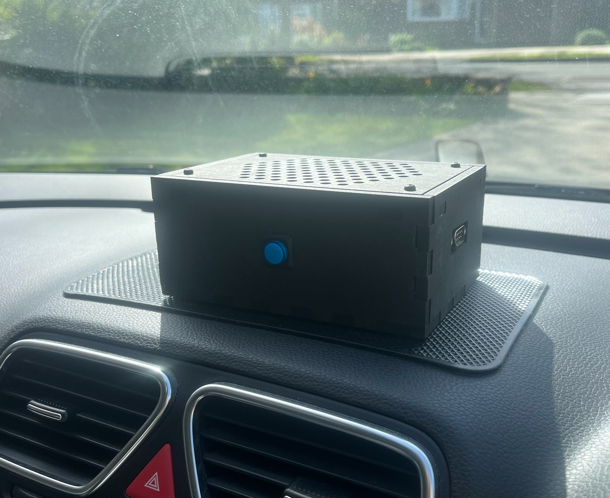
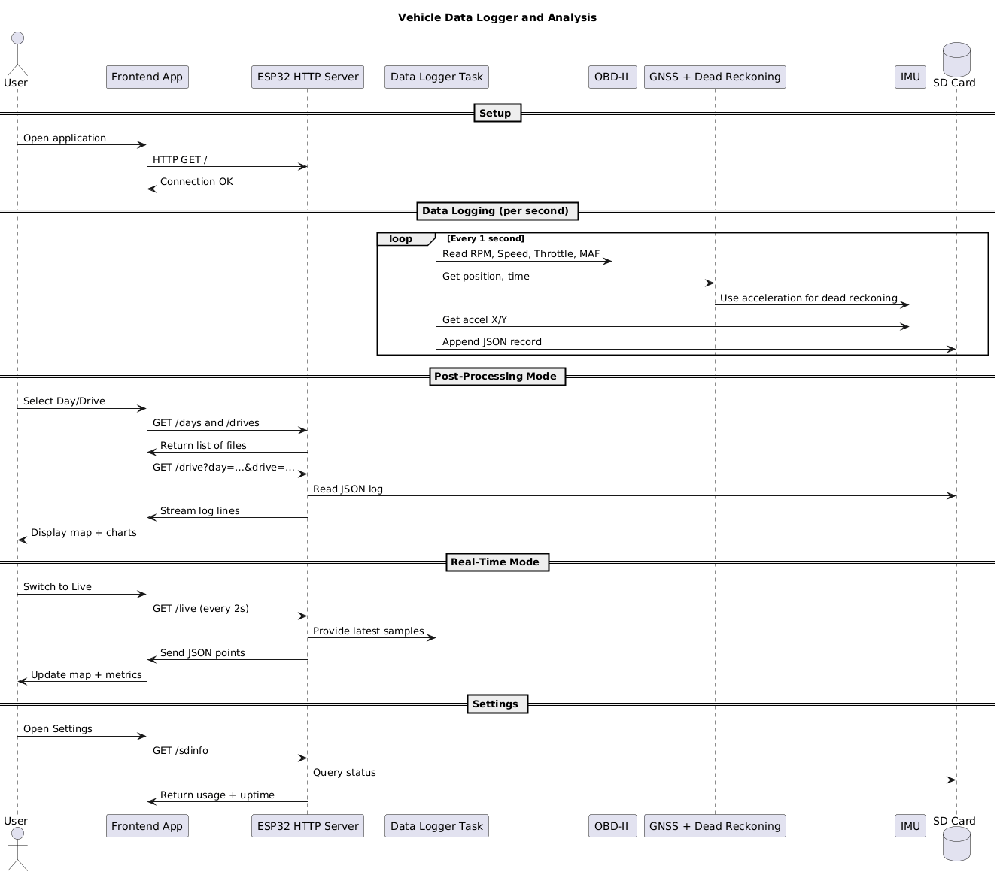
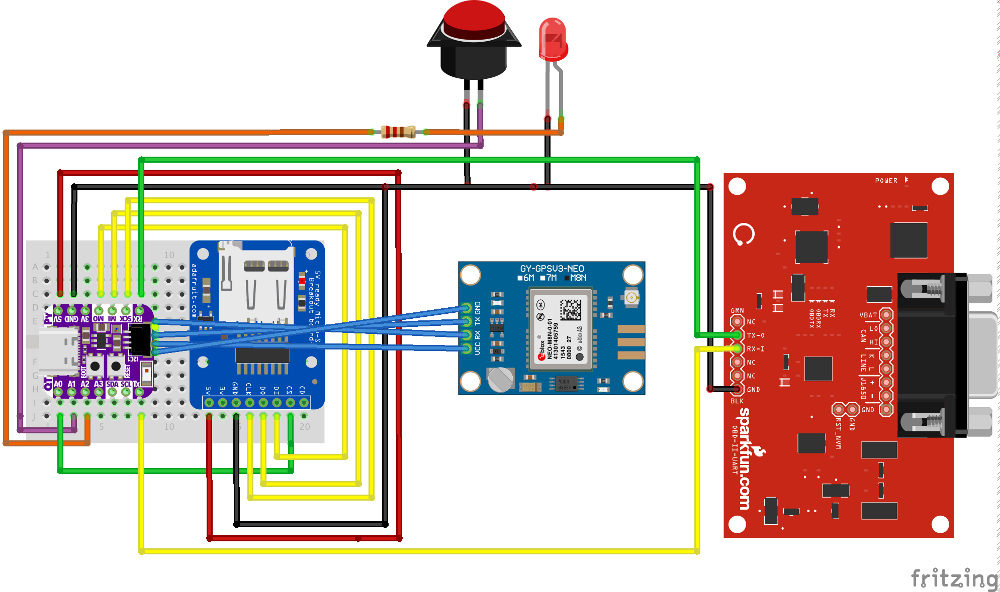

# Vehicle Data Logger and Analysis

  
  

This project was developed as my final year Computer Science dissertation at the University of the West of England. It is an embedded and software system that records, stores, and visualises vehicle telematics data. The aim was to create a device where users can analyse their driving style to improve fuel economy and thus reduce emissions.

The full dissertation report, which provides detailed design, methodology, and evaluation of the project, is available here [Vehicle Data Logger and Analysis Report](docs/Report.pdf)

## Embedded System

The system is built around an Adafruit QTPY S3 ESP32 which acts as the data logger. The ESP32 connects to the vehicle’s OBD-II interface to read engine speed, vehicle speed, throttle position, and mass air flow. A GNSS module provides position and time information, and it supports dead reckoning so that location data remains available even when satellite signal is lost, such as in tunnels or urban areas. An IMU records acceleration values that are used both for dead reckoning and to detect harsh braking, cornering and acceleration.

All data is written once per second to an SD card in JSON format. Each journey is saved as a separate file inside a folder named by date.

## Communication

The ESP32 runs a HTTP server and creates its own Wi-Fi access point - this allows the system to be accessed directly. The server provides endpoints to check connectivity, list available days and drives, download journey files, stream live data, display SD card statistics, and delete recordings.

## Frontend Application

A companion application was developed using Svelte and packaged with Tauri. It connects to the ESP32 over Wi-Fi and provides three modes of operation.

In post-processing mode, the user can load a previous journey, view the route on a Leaflet map, and colour the route by speed, RPM, throttle position, or fuel efficiency. Chart.js is used to generate time-based graphs for speed, RPM, instant and average MPG, throttle position, mass air flow, and acceleration.

In real-time mode, the interface polls the ESP32 every two seconds, updates the map with the latest GPS coordinates, and displays live metrics.

In settings mode, the user can view SD card status, check device uptime, and delete journeys or entire days.

## Data flow Diagram

## Hardware Circuit Design

